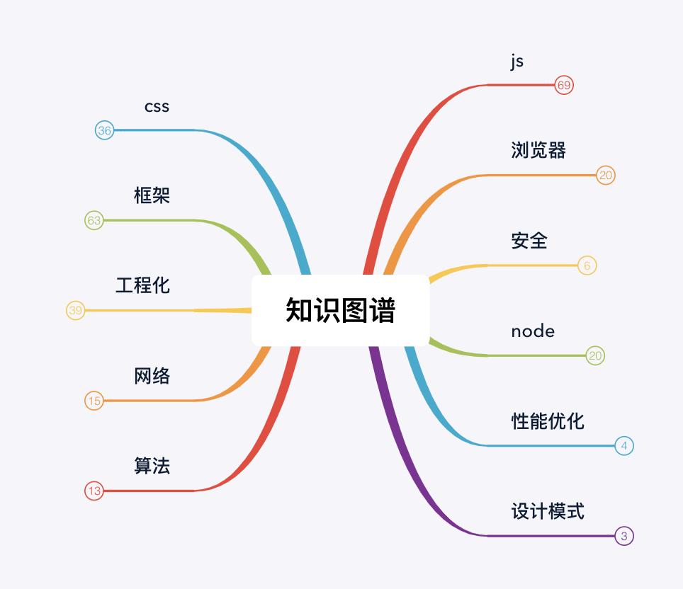

此前端知识文档是Fork于[zhoushaw](https://github.com/zhoushaw/F2E)处，感谢zhoushaw。此后我将在我的仓库去维护和添加其它的前端知识。

<!--  -->

## 目录

* [JavaScript基础知识](./requestion/js.md)
    * [基础知识](./requestion/js.md#基础知识)
    * [重要概念](./requestion/js.md#重要概念)
    * [手写函数](./requestion/js.md#手写函数)
* [css必懂知识点](./requestion/css.md)
    * [BFC是什么有什么作用](./requestion/css.md#BFC)
    * [盒模型](./requestion/css.md#盒模型)
    * [选择器优先级](./requestion/css.md#选择器优先级)
    * [清浮动](./requestion/css.md#清浮动)
    * [层叠上下文](./requestion/css.md#层叠上下文)
    * [css性能优化](./requestion/css.md#css性能优化)
* 前端框架
    * [vue高频题](./requestion/vue.md)
    * [react高频题](./requestion/react.md)
* 周边生态
    * [webpack](./requestion/webpack.md)
* 前端架构
    * [微前端](./JavaScript/架构/micro-front-end.md)
* [浏览器相关](./requestion/browser.md)
* [性能优化相关](./requestion/performance.md)
* [网络相关高频题](./requestion/network.md)
* [node高频题](./requestion/node.md)
* [安全相关](./requestion/safe.md)