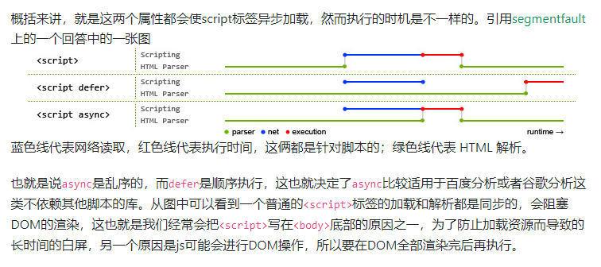
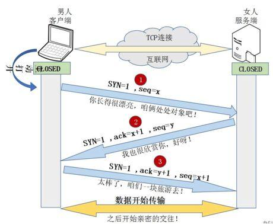

## 目录

* [event loop](#eventloop)
* [缓存](#缓存)
* [浏览器存储](#浏览器存储)
* [重绘与回流](#重绘与回流)
* [点击穿透](#点击穿透)
* [事件捕获与冒泡](#事件捕获与冒泡)
* [停止冒泡和捕获与阻止默认行为](#停止冒泡和捕获与阻止默认行为)
* [webworker多进程](#webworker多进程)
* [JSbridge](#JSbridge)
* [浏览器有几个线程](#浏览器有几个线程)
* [浏览器渲染html](#浏览器渲染html)
* [垃圾回收](#垃圾回收)
* [标签通信](#标签通信)
* [从输入url到页面完成加载发生了什么](#从输入url到页面完成加载发生了什么)

## 内容

> 1.event loop

<a name="eventloop"></a>
https://juejin.cn/post/6909702892597641229

* 浏览器环境
    * 1.首先执行同步任务，遇到异步任务会挂起，异步任务回调结束了会将其根据异步任务的类型分类
    * 2.微任务将微任务推入微任务队列，遇到宏任务将宏任务推入队列
    * 3.同步任务执行完成，先清空微任务队列，先进先出。遇到微任务，或宏任务，继续按照步骤1走
    * 4.微任务清空完成、清空宏任务。遇到微任务，或宏任务，继续按照步骤1走
    * 微任务
        * Promise>MutationObserver
    * 宏任务：
        * setTimeout、setInterval、setImmediate、messageChannel
* node环境
    * 微任务：process.nextTick(在nextTickQueue后执行)>Promise
    * 宏任务分类：
        * timer：执行上一轮setTimeout、setInterval到期后的callback
        * i/o：上一轮循环少数I/o
        * poll：fs.readFile、
        * check：setImmediate,callback
        * close: socket.on('close',...)
    * nodev12版本前：
        * 执行顺序：
            * 执行同步代码，宏任务按照任务分类从上到下执行
            * 每一个宏任务队列执行完成会清空微任务队列,宏任务未到时间的，下一次循环执行
    * nodev12版本后：
        * 执行同步代码、遇到微任务将微任务推入微任务队列，遇到宏任务将宏任务推入宏任务队列
        * 优先清空微任务队列，清空宏任务队列，按照分类从上到下清空，宏任务未到时间的，下一次循环执行

> 2.缓存

<a name="缓存"></a>

* appcache：
    * 设置：html 设置`<html manifest="list.manifest">`
    * 声明：list.manifest文件，并配置可缓存的资源
    * 缺点，控制文件失效很麻烦
* serverwork
* 浏览器缓存 （强缓存和协商缓存）
  https://juejin.cn/post/6844904115798032392


> 3.浏览器存储

<a name="浏览器存储"></a>

* cookie的诞生是基于http无状态的特性
    * cookie组成部分：
        * name（cookie的名称）
        * domain（cookie的生效域名）
        * value（cookie的值）
        * path（生效的路径）
        * expires、max-age（生效的时间）
        * http-only: true（只能通过http携带走cookie，不能使用js操控）
        * sameSite:
            * Strict，只会向当前协议、主机、端口一致的请求发送cookie
            * Lax，允许部分第三方携带cookie。默认是Lax
            * None，是否跨站都会发送cookie
    * 跨域携带cookie：
        * withCredentials = true;
    * js操作cookie
        * 读取浏览器中的cookie
            * `console.log(document.cookie)`;
        * 写入cookie
            * `document.cookie='myname=zhoushaw;path=/;domain=.baidu.com;secure'`;
            * httpOnly只能服务端设置
            
    * 服务端设置cookie（response内有cookie字段）
        * set-cookie: `name=val;path=paths;domain=domain`
        * 设置多个cookie时，多个set-cookie
    * 特点：
        * 存储内容小，4kb左右大小
        * 设置了一定的失效时间
        * 用于解决http无状态的问题
        * cookie过多会导致http性能问题，通过cdn形式让静态资源不要携带cookie
    * 安全：
        * 用于存储用户状态
        * 可以设置为只能http请求时携带，不能js读取
        * secure，设置为只能https时携带
        * same-site,只能在同域名中携带cookie
* localstorage
    * 特点：
        * 长时间存储，下次访问网站，网站可以直接读取以前保存的数据
        * 存内容大，接近5m
        * 客户端使用，不与服务端通信
        * 接口封装较好
        * 只能存储字符串，对象要转化成字符串存储
    * 作用范围：
        * 协议、主机名、端口相同可以访问
    * 场景：
        * 存储base64位图片
    * 操作：
        * 读数据：`window.localStorage.getItem('name')`
        * 写数据：`window.localStorage.setItem('name','zhoushaw')`
        * 删除数据：`window.localStorage.remove('name')`
        * 清空数据：`window.localStorage.clear()`
* sessionstorage:
    * 特点：
        * 会话时存储，标签或浏览器关闭后清空
        * 大小5m左右
        * 仅在客户端使用，不与服务端通信
        * 接口封装较好
        * 只能存储字符串，对象要转化成字符串存储
    * 作用范围：
        * 协议、主机名、端口、窗口
    * 场景：
        * 有效维护表单数据，刷新不丢失
        * 存储本次会话的浏览足迹
    * 操作：
        * 读数据：`window.sessionStorage.getItem('name')`
        * 写数据：`window.sessionStorage.setItem('name','zhoushaw')`
        * 删除数据：`window.sessionStorage.remove('name','zhoushaw')`
        * 清空数据：`window.sessionStorage.clear()`
* indexDB:
    * 详细参考：`http://www.ruanyifeng.com/blog/2018/07/indexeddb.html`
    * 用于客户端存储大量结构化数据：文件、blobs、JavaScript对象，使用索引来实现对该数据的高性能搜索，indexDB是一个运行在浏览器上的非关系数据库
    * 特点：
        * 存储大小不会小于250m
        * 键值对存储：存储数据类型广，包括文件、blobs、JavaScript对象
        * 异步读取，减少性能损耗
        * 同源限制，域名只能访问自身的数据库，不能访问其他域名数据库
        * 支持事务，一些列操作中有一个失败，整个事务取消，数据库回滚到事件发生前的状态
    * 操作：
        * 打开数据库：`var request = window.indexedDB.open(databaseName, version);`
        * 打开数据库失败：`request.onerror = function (event) { console.log('数据库打开报错'); };`
        * 打开数据库成功：
            ```javascript
                var db;
                request.onsuccess = function (event) { 
                    db = request.result;
                    console.log('数据库开成功');
                }
            ```
        * 新建数据库:
            * onupgradeneeded
            ```javascript
            request.onupgradeneeded = function(event) {
                db = event.target.result;
                var objectStore = db.createObjectStore('person', { keyPath: 'id' });
            }
            ```
> 4.重绘与回流

<a name="重绘与回流"></a>

* 前置内容：
    * 浏览器是流式布局的
    * 浏览器会将HTML解析成DOM（Document object model）、CSSOM（css object model）、两者合并生成render tree
    * 根据样式确定节点位置形状大小，将节点绘制在页面上
* 回流（reflow）
    * 当render Tree中部分或全部元素的尺寸、结构或某些属性发生变化时，浏览器重新渲染部分或者全部文档的过程称为回流
    * 造成回流的操作：
        * 页面首次渲染
        * 浏览器窗口大小发生变化
        * 元素尺寸和位置发生变化
        * 元素内容发生变化（文字数量和图片大小）
        * 元素字体大小发生变化
        * 添加删除可见dom
        * 激活css伪类，例如：hover
        * 查询某些属性或调用某些方法
        * 导致回流的属性和方法：
            * `clientWidth、clientHeight、clientTop、clientLeft`
            * `getBoundingClientRect()、scrollTo`
* 重绘（repaint）
    * 当元素的样式改变并不影响它在文档中的位置时
    * 如：`color、background-color、visibility`
    * 浏览器会将样式赋予给元素，并重新绘制它，这个过程称之为重绘
* 性能影响：
    * 有时即使仅仅回流一个元素，它的父元素和兄弟元素都会受到影响，也会产生回流
    * 浏览器会对频繁的回流和重绘操作进行优化，将所有引起回流和重绘的操作放入队列中，等到一定的数量或者时间阈值后，一次性清空队列中的回流和重绘操作，这样可以把多次回流和重绘的操作变成一次
        * 当访问对象上的大小和位置属性时，浏览器会将队列一次性清空，以便于获取到回流和重绘后的值

* 减少和避免回流
    * css
        * 避免使用table布局
        * 尽可能在dom树的末端改变class
        * 将动画运用到脱离文档流的元素上，position: absolute、fixed、
        * 避免使用css：calc()
    * JavaScript
        * 避免频繁操作，最好一次性操作style属性，将样式放在class中更改class
        * 避免频繁操作DOM，创建`documentFragment`,在上面应用所有的`DOM操作`,再添加到文档中
        * 避免频繁读取重绘和回流的属性，如果需要可以缓存起来
        * 复杂动画的元素使其脱离文档流，避免父元素和后续元素受到影响

> 5.点击穿透：

<a name="点击穿透"></a>

* 出现原理
    * 原来页面支持双击放大
    * 移动端click事件会有300ms延迟，浏览器会判断是否缩放
    * 禁止浏览器缩放：
        * `<meta name="viewport" content="width=device-width,initial-scale=1.0,maximum-scale=1.0,maximum-scale=1.0,user-scalable=no,viewport-fit=cover" />`

> 6.事件捕获与冒泡

<a name="事件捕获与冒泡"></a>

* 事件捕获与冒泡主要是为了解决，内层元素、与外层元素都绑定了事件，点击内层元素是内层元素先触发还是外层元素先触发
* DOM0级事件绑定：
    * 直接通过dom绑定事件，默认冒泡
    * `<div onclick="console.log('冒泡事件')">s2</div>`
* DOM2级事件绑定:
    * `window.addEventListener`
        * 事件名
        * 回调函数
        * 配置对象/是否捕获（默认false，冒泡阶段触发）
            * 是否捕获和是否最多调用一次
            * 是否捕获
> 7.停止冒泡和捕获与阻止默认行为

<a name="停止冒泡和捕获与阻止默认行为"></a>

* 当我们在内层元素添加事件时，点击事件会向上冒泡，我们不希望他向上冒泡可以通过
    * `e.stopPropagation()`
    * IE浏览器：`e.cancelBubble`


```html
<div id='div' onclick='alert("div");'>
    <ul onclick='alert("ul");'>
        <li onclick='alert("li");'>test</li>
    </ul>
</div>
```

* 取消默认事件

```javascript
var a = document.getElementById("testA");
    a.onclick =function(e){
    if(e.preventDefault){
        e.preventDefault();
    }else{
        window.event.returnValue == false;
    }
}
```
> 8.webworker多进程

<a name="webworker多进程"></a>

* [阮一峰 web worker](http://www.ruanyifeng.com/blog/2018/07/web-worker.html)
* 出现原因：
    * 由于JavaScript是单线程，在CPU计算能力增加多核的情况下，单线程无法充分利用CPU资源会导致CPU资源的浪费
    * worder在后台运行，不会对UI造成阻塞，这样有利于随时与主进程进行通信，这样有利于随时与主进程通信
* 使用注意：
    * 资源必须是同源，受同源策略限制
    * DOM限制，无法使用document、window等对象，worker可以使用navigator、location对象
    * 通信联系
    * 脚本限制，不可以使用alert、confirm。但是可以使用XMLHt'tprequest
    * 文件限制，不能加载本地资源，必须是网络资源
* 使用：
    * 主线程：
        * `worker = new Worker(file)`创建线程
        * 主线程调用`worker.postMessage()`方法，向 Worker 发消
        * 主线程通过`worker.onmessage`指定监听函数，接收子线程发回来的消息
        * 关闭子进程：
            * `worker.terminate();`关闭子线程
        * 监听子线程错误：
            * `worker.onerror`、`worker.addEventListener(error,...)`
    * 子线程：
        * 监听主进程消息：`self.addEventListener()`、`self.onmessage`指定监听函数
        * `Worker 加载脚本`importScripts
        * 关闭进程：`self.close();`

> 9.JSbridge

<a name="JSbridge"></a>

* [参考文章](https://juejin.im/post/5e5248216fb9a07cb0314fc9)
* 功能：给JavaScript提供调用Native的能力，核心是Native和非Native的通信通道，而且是双向通信通道
* Native 与 JavaScript 的每次互相调用看做一次 RPC 调用
* Native向webView注入api

* UIWebView可以拦截所有的网络请求，JavaScript可以在发起自定义的网络请求
    * `jsbridge://methodName?param1=value1&param2=value2`
    * 可以通过加载`iframe`加载对应的链接，然后移除掉
    * webView对`jsbridget`进行拦截，转而执行响应的调用逻辑
    * 速度较慢
    * 
    ```javascript
    var url = 'jsbridge://doAction?title=分享标题&desc=分享描述&link=http%3A%2F%2Fwww.baidu.com';
    var iframe = document.createElement('iframe');
    iframe.src = url;
    document.body.appendChild(iframe);
    setTimeout(function() {
        iframe.remove();
    }, 100);
    ```
* android有三种调用方式：
    * 对url协议进行解析，通过插入`iframe`
    * 通过重写alert、confirm、prompt方法，分别被WebView的onAlert、onConfirm监听
    * 基于webView的能力，向window上注入对象或方法。通过调用对象或方法进行调用，js需要等执行完逻辑才能到回调里
    * native调用JavaScript
        * 通过webview的`loadUrl`,`webView.loadUrl("javascript:" + javaScriptString);`
        * `evaluateJavascript`,`webView.evaluateJavascript(javaScriptString,callback)`

> 10.浏览器有几个线程

<a name="浏览器有几个线程"></a>

* GUI渲染线程
* JavaScript线程
* 事件触发线程
* 插件线程
* 定时器触发线程
* 异步http请求线程

> 11.浏览器渲染html

<a name="浏览器渲染html"></a>

[渲染过程](https://juejin.im/post/59d489156fb9a00a571d6509)

* 构建DOM（文档对象模型）
    * 将html构建成多个tokens
    * 将tokens解析成对象的形式，描述属性、信息
    * 将object组成一棵树的结构,
* 构建CSSOM（样式对象模型）
    * 构建与DOM构建一致
* 构建Render Tree
    * 结合DOM和CSSOM构建Render树
* Layout
    * 计算每个元素相对于viewPort的位置
* Paint
    * 将render Tree转成像素，显示在屏幕上

* 渲染阻塞的优化方案：
浏览器在遇到css、script时会中断渲染，加载并执行script

* css
    * 通过meida，在符合条件情况加载，横屏，或者特定尺寸
* script
    * html在解析过程中遇到`<script>`会将控制权交给JavaScript引擎会阻塞渲染，直到执行结束，从中断的地方继续渲染
    * 通过async、defer来延后执行

    async就是异步，在不影响其他资源加载的同时，异步加载这个文件并立即执行
    defer会异步下载，但延迟执行。 defer脚本会在文档渲染完毕后，DOMContentLoaded事件调用前执行。


使用场景：比如有些第三方库，要求在header中引入（这就意味着第三方插件库会优先加载），但是我们并不需要在页面加载之初就用到这个插件。那么我们可以加上defer属性使之最后加载。同理，如果页面加载的同时需要用到第三方插件，那么我们引用的时候可以加async属性，这样网站内的资源就可以与插件资源异步加载。这中方法会给网站其他资源的加载节省出一些时间，不失为一种页面优化的方法。
* 预加载
  
开发过程中可能遇到某些资源不需要马上使用但是希望尽早获取，这个时候就可以使用预加载
预加载其实是声明式的 fetch ，强制浏览器请求资源，并且不会阻塞 onload 事件，可以使用以下代码开启预加载

` <link rel="preload" href="http://example.com"> `

预加载可以一定程度上降低首屏的加载时间，因为可以将一些不影响首屏但重要的文件延后加载，唯一缺点就是兼容性不好

* 预渲染

可以通过预渲染将下载的文件预先在后台渲染，可以使用以下代码开启预渲染

` <link rel="prerender" href="http://poetries.com"> `

> 13.垃圾回收

<a name="垃圾回收"></a>

[GC垃圾回收](https://juejin.im/post/5a6b3fcaf265da3e2c385375)
[常见内存泄漏](https://juejin.im/post/5b684f30f265da0f9f4e87cf)

* 作用：
    * 找到内存空间的垃圾
    * 回收这一部分内存，让程序能够再次使用这一部分空间
* 引用计数法
    * 对引用的对象标记+1，对于循环引用将会导致GC无法回收，应该被回收的内存
    * 对象置空后-1，引用为0时会即可回收
* 标记清除
* 内存泄漏：
    * 由于某种原因程序未释放或无法释放造成系统内存泄漏
    * 导致运行减速或系统崩溃

> 14.标签通信

<a name="标签通信"></a>

* postMessage
* localstorage
* shareWorker


### 15.从输入url到页面完成加载发生了什么
<a name="从输入url到页面完成加载发生了什么"></a>
https://juejin.cn/post/6844904122206912526

* 输入URL
* DNS解析
* 浏览器与服务器建立TCP连接（TCP三次握手）
* 浏览器向服务器发送http请求
* 服务器处理请求并返回HTTP报文
* 浏览器解析渲染页面
* 断开连接（TCP四次挥手）
  
> DNS解析

DNS(domain name system，域名系统)：因特网上域名和IP地址相互映射的分布式数据库；简单理解就是域名与IP地址的对照表，因为域名（如：www.google.com）对于我们而言，更便于记忆，但是机器却不擅长这种表达方式，因此需要将域名转换为IP地址，以便于机器识别， 这便有了DNS。
而域名解析就是通过主机名最终获得对应IP地址的过程。


* 域名解析的过程
    * 递归查询:
        客户端主机向本地域名服务器的查询是递归查询；所谓递归查询：客户端主机查询的域名地址无法在本地域名服务器中找到，因此本地域名服务器就以DNS客户端的身份向其他根域名服务器发起请求，进行查询，而不是让客户端主机去一直查询；递归查询的结果要么是返回的IP地址，要么是报错，表示无法查询到地址；
    * 迭代查询
        本地域名服务器向根服务器、顶级域名服务器和主机域名服务器发起的查询请求就是迭代的过程，如：本地域名服务器向根服务器发起查询请求，根服务器中会告诉本地域名服务器：”我这里没有你要找的内容，你去顶级域名服务器上找吧“，并将顶级域名服务器的地址返回给本地域名服务器，本地域名服务器接收到后，继续向顶级域名服务器发送请求；顶级域名服务器要么返回ip地址，要么告诉本地域名服务器下一步要向哪个权限域名服务器发送请求，直到找到ip地址或找不到ip返回报错信息，然后信息返回给客户端主机；

    递归过程：主机→本地DNS服务器→其他DNS服务器（如：我要找一个苹果吃，找到了A，问A有没有，A说我帮你去找B，B可能有，果真B有，然后B将苹果给了A，A再将苹果给我，这就是递归）

    迭代过程：本地DNS服务器→根服务器，本地DNS服务器→顶级域名服务器，本地DNS服务器→权限域名服务器；（如：我要找一个苹果，找到了A，A说我也没有，B可能有，你去找B吧；我又找B，B说我也没有，你去找C吧，我又去找C，终于找到了苹果，这就是迭代的过程）
   
   __从客户端到本地DNS服务器是属于递归查询，而DNS服务器之间就是的交互查询就是迭代查询。__
> 浏览器与服务器建立TCP连接（TCP三次握手）



  https://baijiahao.baidu.com/s?id=1654225744653405133&wfr=spider&for=pc

> 浏览器向web服务器发送HTTP请求

TCP三次握手之后，开始发送HTTP请求报文至服务器 (https://blog.csdn.net/qq_39735040/article/details/96749197)

HTTP请求报文格式：请求行+请求头+空行+消息体，请求行包括请求方式（GET/POST/DELETE/PUT）、请求资源路径（URL）、HTTP版本号；

> 服务器处理请求并返回http报文

http响应报文格式：响应行+响应头+空行+小西天，响应行包括 http版本号，响应状态码，状态说明

> 浏览器解析渲染页面

* 根据获取到的html文件解析出dom Tree；
* 根据css解析出cssOM Tree（css规则树）；
* 将dom Tree和cssOM Tree合并成render Tree（渲染树）；
* 重排：根据render Tree进行节点信息计算（layout）；
* 重绘：根据计算出来的信息绘制出整个页面（painting）。

> 连接结束 （TCP四次挥手）

